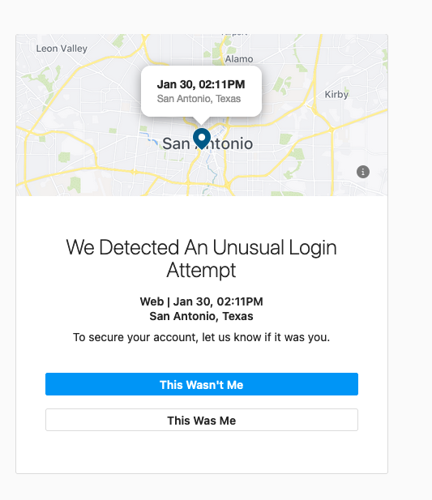

# Insta-Tracker 

Simple script for keeping track of your followers list on Instagram through Github Actions. (uses [instaloader](https://instaloader.github.io/) library)

> The confidential information about your Instagram account needs to be set on Github Secrets of your repository,
You can check out about how to setup Github secrets from here: https://github.com/Azure/actions-workflow-samples/blob/master/assets/create-secrets-for-GitHub-workflows.md

> Instagram might complain about your login location since it will be US when you try it on Github Actions. Like an error given below

You need to go to [Github Actions tab](https://github.com/merkez/instracker/runs/4999253205?check_suite_focus=true) and verify the request and re-run Github actions. 

Currently, it will log given Instagram account followers every day at 00:00 UTC and create release which contains list of followers with following information. 

- User Profile Picture Link
- User Name 
- Real Name

Final result will be csv file which contains given information above. 

The information, output format and way of getting followers might be changed. 

